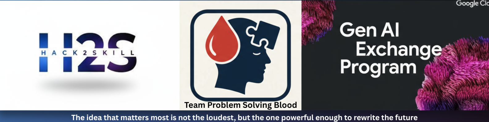

# AI Career & Skills Advisor for collage & Hostel Students  

**Team**: Problem Solving Blood 
**Hackathon**: Google Exchange AI Hackathon 2025  
**Members**: Balaji Boddu, RAJESH G, Praneetha, k Surya Akhil Varma,k Yuva Shanker


## Why It's Needed  

Indian collage & hostel students face **career confusion** amplified by:  
- Generic counseling that ignores personal skills, interests, and financial status.  
- Rapid job market changes that make traditional advice obsolete.  
- Financial constraints that make many upskilling paths impractical.  

Our solution tackles this by **combining real hostel expense tracking with AI-powered career guidance**.  

---

## Features  

- **Hostel Expense Dashboard**: Track monthly living expenses.  
- **Financial-Aware Career Advice**: Recommendations never exceed real budgets.  
- **Resume Analysis (Analyzer Agent)**: Extracts and scores key skills.  
- **Upskilling Suggestions (CV Writer Agent)**: Recommends courses aligned with goals and finances.  
- **Job Search & Matching (Job Searcher Agent)**: Finds relevant jobs tailored to skills, budget, and location.  
- **Web Research (Web Searcher Agent)**: Collects dynamic job market trends.  
- **AI Chat Consultation (Chatbot Agent)**: Interactive career Q&A.  
- **Consultancy & Mentorship Integration**: Access to experts within the platform.  
- **Visual Dashboards**: Expense flows, career pathways, and skill roadmaps.  

---

## Architecture Overview  

Our platform uses a **Supervisor Multi-Agent Orchestration Model**:  

- **Supervisor Agent**: Manages workflow, ensures budget-sensitivity.  
- **Specialized Agents**:  
  - Analyzer → Resume & Skills  
  - CV Writer → Upskilling & Courses  
  - Job Searcher → Career & Job Listings  
  - Web Searcher → Market Trends  
  - Chatbot → Interactive Q&A  

---

## Key Components  

- **Expense Management Integration**: Links monthly hostel expense repo.  
- **Career Funnel**: Filters based on resume, skills, location, budget, package, consultancy, and company fit.  
- **Dynamic Updates**: Adapts to job market changes using APIs.  

---

## Technologies Used  

- **Frontend**: React.js, HTML, CSS  
- **Backend**: Python, Flask, Streamlit  
- **AI/ML**: Multi-agent frameworks ( LangChain), Graph Neural Networks  
- **APIs**: Gemini API, Groq, LinkedIn  
- **Database**: MySQL  
- **Deployment**:  Netlify

---

## Installation  

```bash
git clone (https://github.com/Balajiscientist/Career_And_Skill_adviser_for_Google_hackathon.git)
cd Career_And_Skill_adviser_for_Google_hackathon
pip install -r requirements.txt
